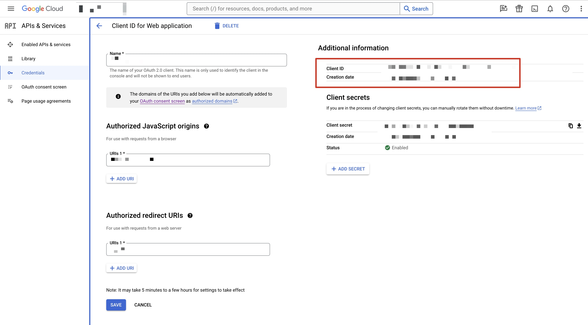
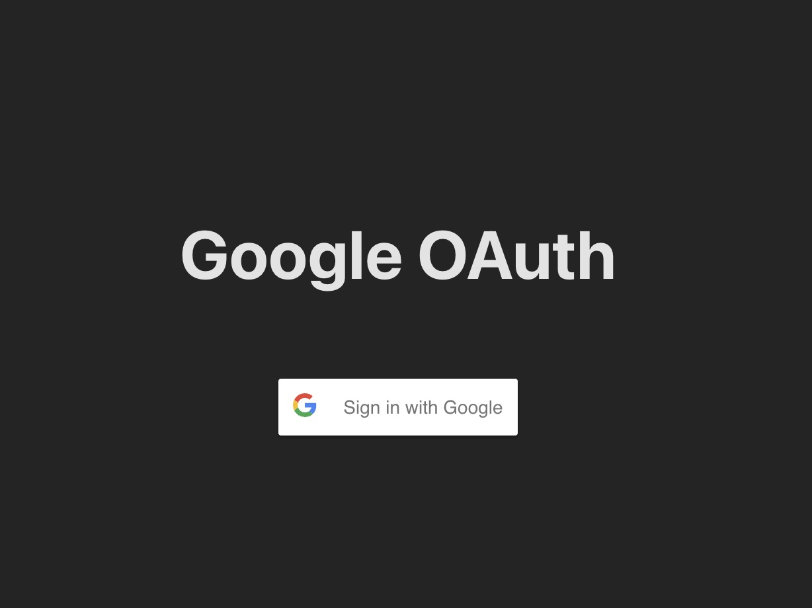
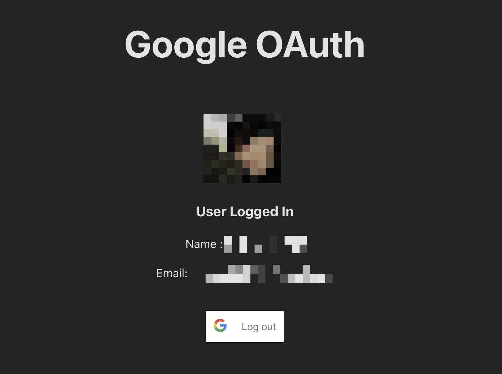

# google-OAuth

- เป็นตัวอย่างการทำ OAuth 2.0 ของ google เพื่อสำหรับการทำ Authorization framework

## Tech Stack in Project 

- **Language**
    - JavaScript(TypeScript)

## Get Started
1. find the client ID for System Oauth 2.0.
- [Google Cloud](https://console.cloud.google.com/)



2. install project.

```bash
  npm install 
  npm run dev
```
## Screenshots

ตัวอย่าง : หน้า Sign in สำหรับ Google



ตัวอย่าง : หน้ารายละเอียดการ Sign in สำเร็จ



## Used By
[](https://github.com/TopThiraphat)

## Support Me
[](https://ko-fi.com/R5R0RDJVK)


